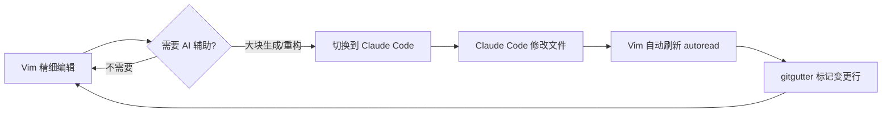

# Vim 常用命令速查 & Claude Code 最佳实践

## 目录

- [Vim 基础操作](#vim-基础操作)
- [插件快捷键](#插件快捷键)
- [代码导航与补全](#代码导航与补全)
- [搜索与替换](#搜索与替换)
- [Git 操作](#git-操作)
- [窗口与 Buffer 管理](#窗口与-buffer-管理)
- [Go 开发](#go-开发)
- [Claude Code 最佳实践](#claude-code-最佳实践)

---

## Vim 基础操作

### 移动

| 命令 | 功能 |
|------|------|
| `h/j/k/l` | 左/下/上/右 |
| `w/b` | 下一个/上一个单词 |
| `0/$` | 行首/行尾 |
| `^` | 行首非空字符 |
| `gg/G` | 文件开头/结尾 |
| `Ctrl+d/Ctrl+u` | 向下/向上翻半页 |
| `Ctrl+f/Ctrl+b` | 向下/向上翻整页 |
| `{/}` | 上一个/下一个段落 |
| `%` | 跳转到匹配的括号 |
| `H/M/L` | 屏幕顶部/中间/底部 |
| `zz/zt/zb` | 当前行居中/顶部/底部 |
| `gk/gj` | 屏幕行上移/下移（已映射到方向键） |

### 编辑

| 命令 | 功能 |
|------|------|
| `i/a` | 光标前/后插入 |
| `I/A` | 行首/行尾插入 |
| `o/O` | 下方/上方新建行 |
| `x/X` | 删除光标处/前一个字符 |
| `dd/yy/p` | 删除行/复制行/粘贴 |
| `dw/cw` | 删除/修改到词尾 |
| `D/C` | 删除/修改到行尾 |
| `u/Ctrl+r` | 撤销/重做 |
| `.` | 重复上一次操作 |
| `>>` / `<<` | 增加/减少缩进 |
| `J` | 合并下一行 |
| `~` | 切换大小写 |

### 可视模式

| 命令 | 功能 |
|------|------|
| `v` | 字符可视模式 |
| `V` | 行可视模式 |
| `Ctrl+v` | 块可视模式 |
| `gv` | 重新选中上次选区 |
| `o` | 切换选区端点 |

### 文本对象

| 命令 | 功能 |
|------|------|
| `ciw` | 修改整个单词 |
| `ci"` / `ci'` | 修改引号内内容 |
| `ci(` / `ci{` / `ci[` | 修改括号内内容 |
| `ca(` | 修改括号及其内容 |
| `dit` / `dat` | 修改 HTML 标签内/含标签 |
| `vip` | 选中段落 |

### 寄存器与宏

| 命令 | 功能 |
|------|------|
| `"ayy` | 复制到寄存器 a |
| `"ap` | 从寄存器 a 粘贴 |
| `"+y` / `"+p` | 系统剪贴板复制/粘贴 |
| `qa` | 开始录制宏到寄存器 a |
| `q` | 停止录制 |
| `@a` | 执行宏 a |
| `@@` | 重复上次宏 |
| `10@a` | 执行宏 a 10 次 |

### 标记与跳转

| 命令 | 功能 |
|------|------|
| `ma` | 设置标记 a |
| `` `a `` | 跳转到标记 a |
| `` `. `` | 跳转到上次修改位置 |
| `Ctrl+o` | 跳转列表后退 |
| `Ctrl+i` | 跳转列表前进 |
| `gd` | 跳转到局部定义 |
| `gD` | 跳转到全局定义 |

---

## 插件快捷键

### NERDTree（文件树）

| 快捷键 | 功能 |
|--------|------|
| `F4` | 切换 NERDTree |
| `o` | 打开文件/展开目录 |
| `t` | 在新 tab 打开 |
| `s` | 垂直分屏打开 |
| `i` | 水平分屏打开 |
| `m` | 显示文件操作菜单 |
| `R` | 刷新目录树 |
| `I` | 显示/隐藏隐藏文件 |

### Tagbar（代码大纲）

| 快捷键 | 功能 |
|--------|------|
| `F9` | 切换 Tagbar |
| `Enter` | 跳转到定义 |
| `p` | 预览（不跳转） |
| `s` | 切换排序方式 |

### fzf（模糊搜索）

| 命令 | 功能 |
|------|------|
| `:Files` | 搜索文件 |
| `:GFiles` | 搜索 Git 文件 |
| `:Buffers` | 搜索 Buffer |
| `:Rg <pattern>` | ripgrep 全文搜索 |
| `:Lines` | 搜索当前 Buffer 行 |
| `:BLines` | 搜索所有 Buffer 行 |
| `:History` | 最近打开文件 |
| `:History:` | 命令历史 |
| `:History/` | 搜索历史 |
| `:Tags` | 搜索 ctags |
| `:Commits` | 搜索 Git 提交 |

### UndoTree（撤销树）

| 快捷键 | 功能 |
|--------|------|
| `F6` | 切换撤销树 |
| `j/k` | 上下移动 |
| `Enter` | 恢复到该状态 |

### vim-surround（包围编辑）

| 命令 | 功能 |
|------|------|
| `cs"'` | 将 `"` 替换为 `'` |
| `cs'<tag>` | 将 `'` 替换为 HTML 标签 |
| `ds"` | 删除 `"` 包围 |
| `ysiw"` | 给单词加 `"` 包围 |
| `yss(` | 给整行加 `()` 包围 |
| `S"` | 可视模式下加 `"` 包围 |

### NERDCommenter（注释）

| 命令 | 功能 |
|------|------|
| `\cc` | 注释当前行/选中行 |
| `\cu` | 取消注释 |
| `\ci` | 切换注释状态 |
| `\cs` | 性感注释（块注释） |
| `\cm` | 最小化注释 |

### vim-visual-multi（多光标）

| 命令 | 功能 |
|------|------|
| `Ctrl+n` | 选中当前词，继续按选下一个 |
| `Ctrl+Down/Up` | 向下/上添加光标 |
| `q` | 跳过当前匹配 |
| `Tab` | 切换光标/扩展模式 |

### AsyncRun（异步执行）

| 快捷键/命令 | 功能 |
|-------------|------|
| `F5` | 异步 Make 构建 |
| `:AsyncRun <cmd>` | 异步执行命令 |
| `:AsyncStop` | 停止异步任务 |

---

## 代码导航与补全

### YouCompleteMe

| 快捷键/命令 | 功能 |
|-------------|------|
| `Ctrl+]` | 跳转到定义（垂直分屏） |
| `\gt` | GoTo（智能跳转） |
| `\gh` | GoToDeclaration |
| `\gr` | GoToReferences |
| `\fi` | FixIt（自动修复） |
| `Ctrl+Z` | 手动触发补全 |
| `:YcmDiags` | 显示诊断信息 |
| `:YcmRestartServer` | 重启 YCM 服务 |

### ALE（语法检查）

| 命令 | 功能 |
|------|------|
| `:ALENext` / `:ALEPrevious` | 下一个/上一个错误 |
| `:ALEDetail` | 查看错误详情 |
| `:ALEFix` | 自动修复 |
| `:ALEInfo` | 查看 ALE 状态 |

### ctags / gutentags

| 命令 | 功能 |
|------|------|
| `Ctrl+]` | 跳转到 tag 定义 |
| `Ctrl+t` | 返回跳转前位置 |
| `:ts <name>` | 搜索 tag |
| `:tn` / `:tp` | 下一个/上一个 tag |
| `:GutentagsUpdate` | 手动更新 tags |

---

## 搜索与替换

### 搜索

| 命令 | 功能 |
|------|------|
| `/pattern` | 向下搜索 |
| `?pattern` | 向上搜索 |
| `n/N` | 下一个/上一个匹配 |
| `*/#` | 搜索光标下单词（向下/向上） |
| `F2` | 取消搜索高亮 |
| `:Rg pattern` | ripgrep 全项目搜索 |
| `:Ack pattern` | ack 搜索 |

### 替换

| 命令 | 功能 |
|------|------|
| `:s/old/new/` | 替换当前行第一个 |
| `:s/old/new/g` | 替换当前行所有 |
| `:%s/old/new/g` | 替换全文所有 |
| `:%s/old/new/gc` | 替换全文（逐个确认） |
| `:'<,'>s/old/new/g` | 替换选中区域 |

---

## Git 操作

### vim-fugitive

| 命令 | 功能 |
|------|------|
| `:Git` / `:G` | 打开 Git 状态窗口 |
| `:Gdiff` | 对比当前文件与 HEAD |
| `:Gblame` | 显示每行的 git blame |
| `:Glog` | 查看文件 git log |
| `:Gwrite` | git add 当前文件 |
| `:Gread` | 恢复到 HEAD 版本 |
| `:GMove` | git mv 重命名 |
| `:GDelete` | git rm 删除 |

### vim-gitgutter

| 命令 | 功能 |
|------|------|
| `]c` / `[c` | 跳转到下一个/上一个变更块 |
| `\hp` | 预览变更内容 |
| `\hs` | 暂存当前变更块（stage hunk） |
| `\hu` | 撤销当前变更块 |

---

## 窗口与 Buffer 管理

### 窗口

| 命令 | 功能 |
|------|------|
| `:sp` / `:vs` | 水平/垂直分屏 |
| `Ctrl+w w` | 切换窗口（已映射 Ctrl+Tab） |
| `Ctrl+w h/j/k/l` | 切换到左/下/上/右窗口 |
| `Ctrl+w =` | 等分窗口 |
| `Ctrl+w _` / `Ctrl+w \|` | 最大化高度/宽度 |
| `Ctrl+w q` | 关闭当前窗口 |
| `Ctrl+w o` | 只保留当前窗口 |

### Buffer

| 命令 | 功能 |
|------|------|
| `:ls` / `:buffers` | 列出所有 buffer |
| `:bn` / `:bp` | 下一个/上一个 buffer |
| `:b <n>` | 跳转到第 n 个 buffer |
| `:bd` | 关闭当前 buffer |
| `:Buffers` | fzf 搜索 buffer |

### Tab

| 命令 | 功能 |
|------|------|
| `:tabnew` | 新建 tab |
| `:tabn` / `:tabp` | 下一个/上一个 tab |
| `gt` / `gT` | 下一个/上一个 tab |
| `:tabclose` | 关闭当前 tab |

---

## Go 开发

### vim-go 常用命令

| 命令 | 功能 |
|------|------|
| `:GoBuild` | 编译 |
| `:GoRun` | 运行 |
| `:GoTest` | 运行测试 |
| `:GoTestFunc` | 运行光标处的测试函数 |
| `:GoDef` | 跳转到定义 |
| `:GoDoc` | 查看文档 |
| `:GoReferrers` | 查找引用 |
| `:GoImplements` | 查看接口实现 |
| `:GoRename` | 重命名 |
| `:GoFillStruct` | 自动填充结构体字段 |
| `:GoAddTags` | 添加 struct tag |
| `:GoRemoveTags` | 移除 struct tag |
| `:GoIfErr` | 生成 if err != nil 代码块 |
| `:GoAlternate` | 在源文件和测试文件间切换 |
| `:GoInstallBinaries` | 安装/更新 Go 工具 |

---

## Claude Code 最佳实践

### 推荐工作流



### 环境搭建

**tmux 分屏方案（推荐）**：

```bash
# 左边 Vim，右边 Claude Code
tmux split-window -h 'claude'

# 或上下分屏
tmux split-window -v 'claude'
```

**Vim 内置终端**：

```vim
" 在 Vim 中打开终端运行 Claude Code
:terminal claude

" 垂直分屏打开终端
:vertical terminal claude
```

### 核心配置（已在 vimrc 中启用）

```vim
" 文件外部变更自动刷新（Claude Code 改代码后 Vim 自动加载）
set autoread
au FocusGained,BufEnter * checktime
au CursorHold,CursorHoldI * checktime
```

> 这些配置确保 Claude Code 修改文件后，切回 Vim 时自动刷新，无需手动 `:e`。

### 日常协作模式

#### 1. Vim 编辑 + Claude Code 重构

```bash
# 终端 1：Vim 编辑代码
vim main.go

# 终端 2：Claude Code 做大块重构
claude "重构 main.go 中的错误处理，使用 fmt.Errorf 包装错误"
```

#### 2. Claude Code `--print` 模式（管道式）

```bash
# 生成代码片段写入文件
claude --print "生成一个 Go HTTP middleware" > middleware.go

# 在 Vim 中读入 Claude 输出
:r !claude --print "生成 table-driven test for ParseConfig"
```

#### 3. 选中代码发送给 Claude

```vim
" 选中代码后发送给 Claude 解释
vnoremap <leader>ce :w !claude --print "解释这段代码"<CR>

" 选中代码后让 Claude 优化
vnoremap <leader>co :w !claude --print "优化这段代码，保持功能不变"<CR>

" 让 Claude 为当前文件生成测试
nnoremap <leader>ct :!claude "为 %:p 生成单元测试"<CR>
```

#### 4. 查看 Claude Code 的修改

```vim
" 查看 Git 变更（Claude Code 修改后）
:Gdiff              " 对比当前文件与 HEAD
]c / [c             " 跳转到下一个/上一个变更块（gitgutter）
\hp                 " 预览变更内容
\hu                 " 撤销某个变更块（不满意时）
```

### 分工原则

| 场景 | 使用工具 | 原因 |
|------|----------|------|
| 精细编辑（改几个字符） | Vim | 快速精准 |
| 大块代码生成 | Claude Code | AI 擅长 |
| 跨文件重构 | Claude Code | 理解项目上下文 |
| 代码审查/阅读 | Vim + Gdiff | 精细对比 |
| 写测试 | Claude Code | 批量生成 |
| 调试定位 | Vim + YCM | 跳转定义、查引用 |
| 文档生成 | Claude Code | 自然语言生成 |
| 快速搜索 | Vim + fzf/Rg | 即时反馈 |

### Claude Code 常用命令

```bash
# 交互模式
claude                          # 启动交互式会话

# 非交互模式
claude --print "问题"           # 只输出答案，不修改文件
claude "修改 xxx"               # 直接执行修改

# 指定文件上下文
claude "优化这个函数" --file main.go

# 自定义 slash 命令（放在 .claude/commands/ 下）
/review                         # 代码审查
/test                           # 生成测试
```

### 自定义 Claude Code 命令

在项目根目录创建 `.claude/commands/` 目录，添加自定义命令：

```bash
# .claude/commands/review.md
请审查当前项目中最近修改的代码，关注：
1. 潜在的 bug
2. 性能问题
3. 代码风格一致性
4. 错误处理是否完善
```

```bash
# .claude/commands/test.md
为 $ARGUMENTS 生成完整的单元测试，要求：
1. 使用表驱动测试
2. 覆盖边界情况
3. 包含错误场景
```

### 技巧与注意事项

1. **保持 Vim 的 autoread 开启**：Claude Code 修改文件后自动刷新
2. **善用 gitgutter**：快速定位 Claude Code 改了哪些行
3. **用 `:Gdiff` 审查**：不满意可以用 `:Gread` 恢复
4. **用 undotree 回退**：`F6` 打开撤销树，可以回到任意历史状态
5. **tmux 是最佳搭档**：左右分屏，Vim 和 Claude Code 各占一半
6. **Claude Code 不擅长的事**：精细的光标移动、复杂的 Vim 宏操作
7. **Vim 不擅长的事**：理解整个项目上下文、批量重构、生成样板代码

---

## 其他实用技巧

### 快速编辑

| 命令 | 功能 |
|------|------|
| `:w !sudo tee %` | 以 sudo 保存 |
| `:earlier 5m` | 回到 5 分钟前的状态 |
| `:later 5m` | 前进到 5 分钟后的状态 |
| `g;` / `g,` | 跳转到上次/下次修改位置 |
| `Ctrl+a` / `Ctrl+x` | 数字加 1 / 减 1 |
| `:sort` | 排序选中行 |
| `:sort u` | 排序并去重 |

### 折叠

| 命令 | 功能 |
|------|------|
| `za` | 切换折叠 |
| `zR` | 展开所有折叠 |
| `zM` | 关闭所有折叠 |
| `zo` / `zc` | 打开/关闭当前折叠 |

### 终端模式

| 命令 | 功能 |
|------|------|
| `:terminal` | 打开终端 |
| `Esc Esc` | 退出终端模式（Unix） |
| `Ctrl+w N` | 终端进入 Normal 模式 |
| `Ctrl+w :` | 终端中执行 Ex 命令 |

### Quickfix

| 快捷键/命令 | 功能 |
|-------------|------|
| `F11` / `F12` | 下一个/上一个 quickfix 项（Mac: Cmd+F11/F12） |
| `Alt+F11` | 打开 quickfix 窗口 |
| `Alt+F12` | 关闭 quickfix 窗口 |
| `:copen` / `:cclose` | 打开/关闭 quickfix |
| `:cnext` / `:cprev` | 下一个/上一个 |
